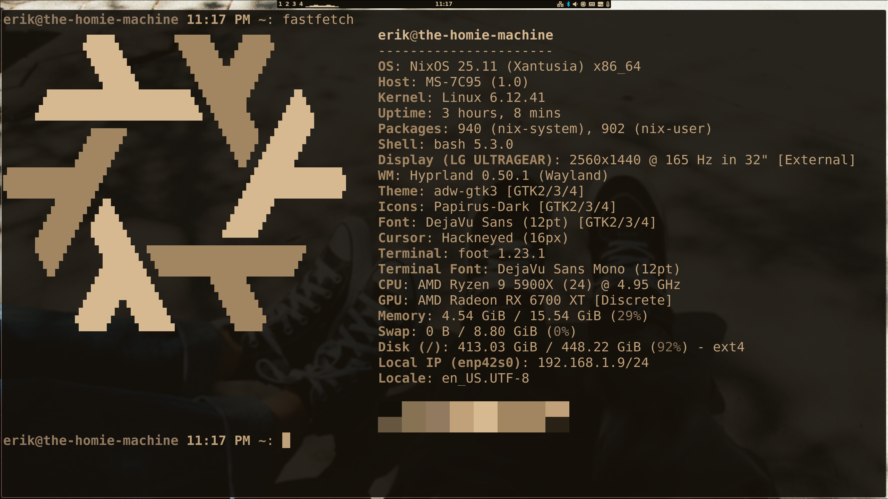

<div align="center">
    <h1><i>The-Homie-Config</i></h1>
    <h4>Powered by NixOS, VIM, and American Football (the band).</h4>
</div>

<div>
    <br> 
</div>

<div align="center">
    <h4>Directory Structure</h4>
</div>

```
.
├── flake.nix
│
├── hosts
│   ├── desktop
│   │   ├── config.nix
│   │   ├── hardware-configuration.nix
│   │   └── home.nix
│   │
│   ├── hacking
│   │   ├── config.nix
│   │   ├── hardware-configuration.nix
│   │   └── home.nix
│   │
│   ├── homelab
│   │   ├── config.nix
│   │   ├── hardware-configuration.nix
│   │   ├── home.nix
│   │   └── services/
│   │
│   ├── laptop
│   │   ├── config.nix
│   │   ├── hardware-configuration.nix
│   │   └── home.nix
│   │
│   └── minecraft
│       ├── config.nix
│       ├── hardware-configuration.nix
│       ├── home.nix
│       └── modules/
│
├── modules
│   ├── home-base.nix
│   ├── home-machines.nix
│   ├── home-servers.nix
│   │
│   ├── home-modules
│   │   ├── base-modules/
│   │   ├── machine-modules/
│   │   └── server-modules/
│   │
│   ├── nixos-base.nix
│   ├── nixos-machines.nix
│   ├── nixos-servers.nix
│   │
│   ├── nixos-modules
│   │   ├── base-modules/
│   │   ├── machine-modules/
│   │   └── server-modules/
│   └── hypr/
│
└── README.md
```

